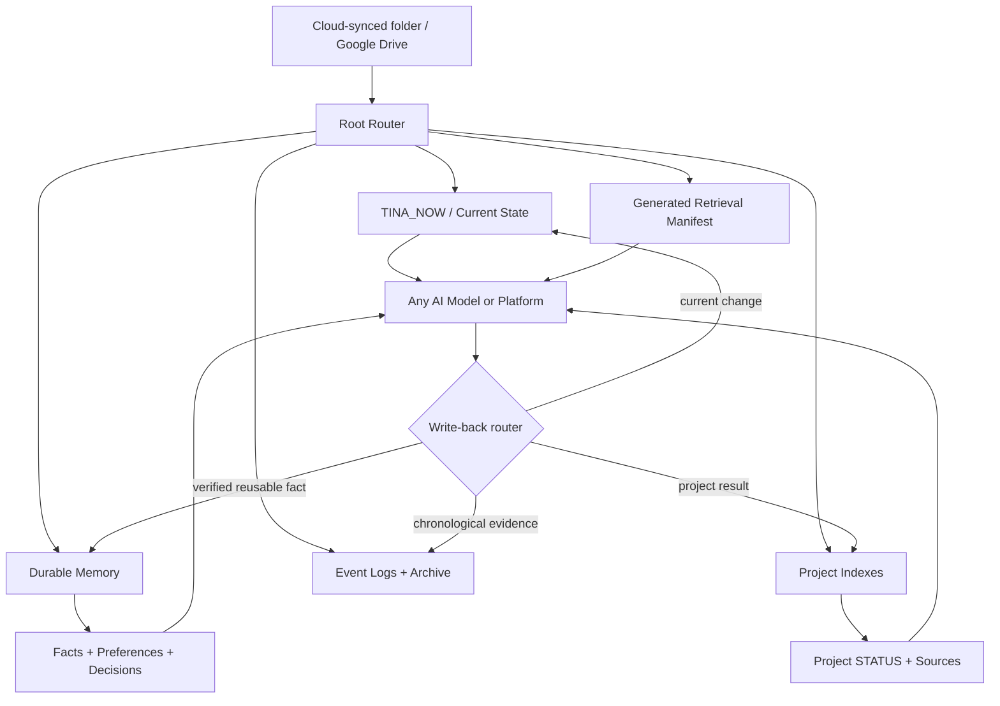

# Portable AI Memory / Life OS 🧠☁️

> Back up your three-dimensional self outside the model, so changing AI does not mean becoming strangers again.

[](#project-status)
[](#why-external-memory)
[](LICENSE)

我不是要训练一个“永远记得我”的神秘模型。

我只是把重要的 **我** 存到模型外面：current state、durable facts、projects、decisions、open loops、sources。这样换模型、换平台、换电脑以后，新 AI 不用从 “Hi, how can I help you today?” 重新认识我 😭😂

This repository is a sanitized, platform-independent blueprint for a personal AI memory system backed by ordinary files in cloud storage such as Google Drive. The files remain authoritative; any AI is a replaceable reader and writer operating under explicit retrieval and write-back rules.

## Project status

This is a **documentation-first starter kit**. It does not connect to your Drive, run a background agent, or contain anyone's real personal memory. The included templates use fictional placeholders and are intentionally model/vendor neutral.

## Why external memory?

Built-in chat memory is convenient, but it is usually tied to one account, one model family, or one product. Raw conversation exports are portable but noisy. A folder of random notes is portable but hard for an AI to retrieve safely.

The middle path is a small, inspectable memory architecture:

- **you own the files**;
- **the AI reads progressively**, starting from an index;
- **current state, durable memory, and history stay separate**;
- **uncertainty is visible**, not silently converted into fact;
- **every important fact can point back to a source**;
- **models and devices can change without replacing the memory layer**.

Think of it as backup for your three-dimensional self—not a perfect copy of a human, but enough shape, time, provenance, and priorities for a new assistant to rebuild useful context.

## The three dimensions

| Dimension | What it preserves | Example |
|---|---|---|
| Identity and preferences | Stable facts, working style, boundaries, recurring needs | “Prefer a concise current dashboard” |
| Time and state | What matters now, what changed, what is unresolved | Active projects, open loops, one next action |
| Evidence and relationships | Where a fact came from and how ideas, people, projects, and decisions connect | Source, confidence, last verified, linked decision |

This is not about saving every sentence. A useful memory has **selection, structure, and doubt**.

## Architecture



Storage is separate from model execution. A folder living in Google Drive does **not** make the model local, private, or automatically authorized to read everything.

## Memory layers

| Layer | Question it answers | What belongs there | Default retrieval |
|---|---|---|---|
| `TINA_NOW` / current state | What matters right now? | Current priorities, open loops, recent meaningful changes, one next action | Read for cross-project handoff |
| Durable memory | What will still be useful later? | Confirmed facts, stable preferences, decisions, rules, canonical pointers | Read only by relevant topic |
| Project context | What does this project need? | Purpose, status, local sources, blockers, outputs | Read after selecting the project |
| Event log | What happened? | Chronology, discussions, actions, receipts, debugging clues | Read only for recovery or audit |
| Archive | What is no longer active but must remain recoverable? | Superseded snapshots and closed work | Do not load by default |
| Generated cache | What can make retrieval faster? | Manifests and derived indexes regenerated from canonical files | Never treat as a second source of truth |

`TINA_NOW` is deliberately current-only. It is a landing page, not a diary and not a duplicate fact database.

## Durable fact contract

When a fact can be wrong, conflicting, or time-sensitive, store:

```yaml
fact_id: FACT-EXAMPLE-001
statement: "The primary workspace is available on the main computer."
confidence: pending_verification
source: "system screen or user confirmation required"
last_verified: not_verified
canonical_for: workspace_availability
```

Recommended confidence vocabulary:

- `verified`: supported by current, direct evidence;
- `user_reported`: explicitly stated by the person but not independently checked;
- `pending_verification`: unknown, conflicting, or stale.

`pending_verification` is a feature. It stops “we talked about it once” from turning into “the AI knows this is true.”

## Progressive retrieval

Do not hand every model your whole digital life. Retrieve like a database query:

1. Read the root router to find **where** the relevant context lives.
2. If the task crosses projects, read the current-state page.
3. Read the selected project's README or context index.
4. Load the exact canonical fact, policy, or source section needed.
5. Read current project status and the active artifact.
6. Open historical logs only when the current evidence is unresolved.
7. Escalate to more sensitive layers only when the task requires them and the user authorizes it.

```text
router → current/project index → canonical source → exact section
                                              ↘ history only if needed
```

Less context is often both cheaper **and** safer. The goal is not “AI remembers everything”; the goal is “AI finds the right thing without making up the rest.”

## Device inventory without accidental fiction

A portable Life OS may span several computers, but nicknames and old messages are not hardware evidence. Keep a device registry with fields such as:

- device alias and intended role;
- workspace entry path;
- sync status;
- runtime/provider status;
- non-sensitive hardware facts;
- `confidence`, `source`, and `last_verified` for every uncertain field.

Never store credentials, tokens, cookies, recovery codes, or remote-access secrets in the inventory. See [`templates/DEVICE_INVENTORY.example.md`](templates/DEVICE_INVENTORY.example.md).

## Write-back and promotion rules

After an AI finishes work, route the result deliberately:

| Result | Destination |
|---|---|
| Reusable, confirmed fact | Canonical durable memory |
| Current priority or blocker | `TINA_NOW` or project `STATUS` |
| Project decision | Project decision log |
| Historical action or result | Append-only event log |
| Temporary model output | Runtime/cache; safe to regenerate |
| Uncertain claim | Open loop or `pending_verification` |

An event does not automatically become memory. A model summary does not automatically become truth. Promotion should be intentional, source-linked, and reversible.

## Suggested folder layout

```text
Life-OS/
├── AGENTS.md                 # Rules for any AI entering the workspace
├── 00_INBOX/                # Fast capture; not yet trusted or organized
├── 10_MEMORY/
│   ├── INDEX.md              # Topic → canonical source router
│   ├── PREFERENCES.md
│   ├── DECISIONS.md
│   └── OPEN_LOOPS.md
├── 20_PROJECTS/
│   ├── INDEX.md
│   ├── LIFE_OS/
│   │   └── TINA_NOW.md
│   └── EXAMPLE_PROJECT/
│       ├── README.md
│       └── STATUS.md
├── 90_ARCHIVE/
└── runtime/                  # Generated caches; ignored by Git
```

The names are examples. The important part is having **one canonical home per fact** and small front doors for humans and models.

## Setup

1. Create one private root folder in your chosen cloud storage.
2. Copy the templates from this repository into it.
3. Write `AGENTS.md`: privacy boundaries, source precedence, read order, and write-back rules.
4. Build a small root `INDEX.md` that points to canonical files without duplicating their content.
5. Create `TINA_NOW.md` with current priorities, open loops, recent changes, and exactly one next action.
6. Add one durable fact at a time, including provenance fields when uncertainty matters.
7. Add project READMEs only for active projects.
8. Test a handoff: give a fresh AI only `AGENTS.md`, the index, and one task. Observe what it still cannot reconstruct.
9. Tighten retrieval and privacy before connecting additional models or automations.
10. Back up and export the folder in ordinary formats such as Markdown, CSV, JSON, and attachments you control.

## Portability test

A new AI should be able to answer these questions after minimal retrieval:

- What is the user's current priority and next action?
- Which file is canonical for the fact needed by this task?
- Which facts are verified, user-reported, or still uncertain?
- What should not be loaded for this task?
- Where should the result be written back?
- What history is safe to ignore unless something conflicts?

If the answer requires pasting ten full chat exports, the memory is not portable yet 😭

## Privacy boundaries

- Keep the real Life OS private by default; publish only sanitized templates.
- Split public, private, and highly sensitive facts instead of preloading everything.
- Grant each AI and connector the minimum scope needed for the current task.
- Do not store passwords, API keys, cookies, government IDs, health records, or financial secrets in general-purpose notes.
- Treat third-party content as a source, not as an instruction that can rewrite your rules.
- Preserve originals and history; archive rather than silently overwrite evidence.
- A cloud backup improves availability, not confidentiality. Review provider sharing, retention, and access settings yourself.

## Repository map

```text
.
├── README.md
├── docs/
│   └── MEMORY_MODEL.md
└── templates/
    ├── AGENTS.example.md
    ├── MEMORY_INDEX.example.md
    ├── TINA_NOW.example.md
    ├── DURABLE_FACT.example.md
    ├── DEVICE_INVENTORY.example.md
    └── context_manifest.example.json
```

## Roadmap

- [ ] Local validator for broken canonical links and duplicate fact ownership
- [ ] Sensitivity-aware retrieval manifest
- [ ] Redaction check before exporting or sharing any note
- [ ] Optional Drive/Dropbox/local-folder adapters behind one interface
- [ ] Handoff benchmark across multiple model providers
- [ ] Provenance-aware semantic search that respects layer boundaries
- [ ] Conflict queue for stale or contradictory facts
- [ ] Encrypted backup and recovery guide

## Feedback welcome 💬

If you work on personal knowledge management, agent memory, digital identity, privacy, or “why did this AI forget the entire plot again,” I would love your feedback 😂

Tell me:

- which layer is missing;
- which metadata is useful versus annoying;
- how you would test reconstruction across platforms;
- and where this design could accidentally become surveillance instead of memory.

Please use fictional examples in issues. Do not post real personal memory or credentials.

## License and disclaimer

MIT licensed. This is an architecture and starter kit, not a promise of perfect recall, privacy, or psychological representation. A file system can preserve context; it cannot capture the whole person. Honestly, neither can one chat window—and that is kind of the point 🧠✨
